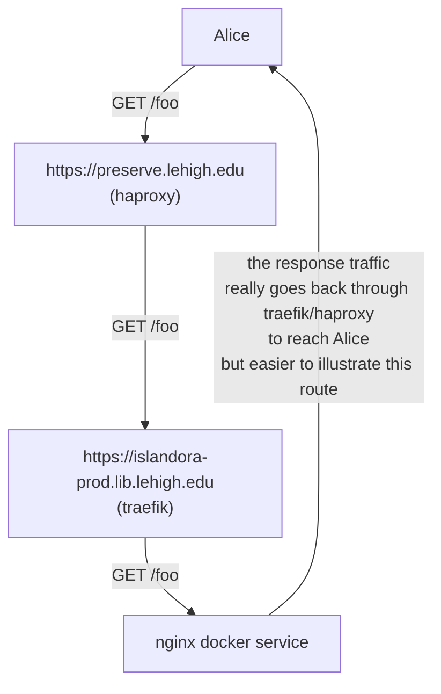
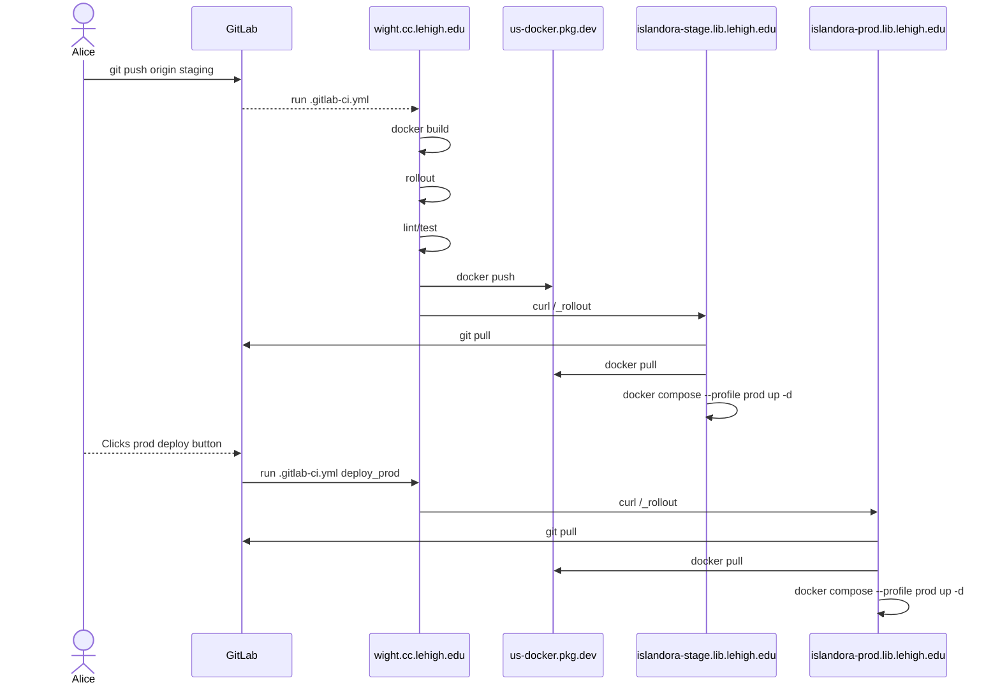

# Lehigh Preserve

- [Introduction](#introduction)
- [Requirements](#requirements)
- [Architecture](#architecture)
- [Production](#production)
  - [Setup as a systemd Service](#setup-as-a-systemd-service)
  - [Monitoring and Metrics](#monitoring-and-metrics)
- [CI/CD](#cicd)
- [Self Healing](#self-healing)
- [Backups](#backups)

## Introduction

This is the development and production infrastructure for Lehigh Preserve.

## Requirements

- [Docker 24.0+](https://docs.docker.com/get-docker/)
- [Docker Compose](https://docs.docker.com/compose/install/linux/) **Already included in OSX with Docker**
- [mkcert 1.4+](https://github.com/FiloSottile/mkcert) **Local Development only**

## Architecture

### Network

Staging and production domains are backends behind SET's managed haproxy instance.

Staging is a backend on SET's internal-only haproxy instance, which requires on-campus or VPN to access. Production is a backend on SET's external haproxy instance which allows `0.0.0.0/0` access. The external haproxy manages TLS certificates for the site as well as a "tarpit" ruleset to block known bad actors // bots.



## Production

### Setup as a systemd Service

`systemd` is used to manage the docker compose stack. You can find the unit file in [scripts/systemd/islandora.service](./scripts/systemd/islandora.service)

The unit runs as the account `rollout` which will need privileges to run docker containers
```
usermod -aG docker rollout
```

The `rollout` account also needs from files used by the islandora docker compose stack

```
$ cat /home/rollout/.env
PROFILE=prod
DOMAIN=islandora-stage.lib.lehigh.edu
SLACK_WEBHOOK="https://hooks.slack.com/triggers/**SCRUBBED**"
HOST=islandora-test

$ cat /home/rollout/.gitconfig
[safe]
	directory = /opt/islandora/d10_lehigh_agile

# auth'd to Google Artifact Registry for lehigh-lts-images
/home/rollout/.docker/config.json
# deploy token for the i2 repo in GitLab
/home/rollout/.ssh/id_rsa
```

### Monitoring and Metrics

### Monitoring

#### Uptime checks

Once `preserve.lehigh.edu` is pointing at i2, we'll have nagios uptime monitoring on the site. For now uptime is monitored with a simple bash script on the staging server that sends alerts to Slack `#libtech-islandora` when production is offline.

##### uriports

We're monitoring our [Content Security Policy](https://developer.mozilla.org/en-US/docs/Web/HTTP/CSP) using URIports.com. We're still in report only mode to avoid regressions as we craft the policy. We hope to have an enfored policy before June 24, 2024.

This URIports service is being used to help craft a content security policy we can enforce on the site to help prevent XSS vulnerabilities on our site. They provide dashboards to see what would have been blocked had our policy been in effect, which helps craft a policy.

We're also emitting network errors which can be [seen in their dashboard](https://app.uriports.com/report/network-error?search=contains%7Cislandora-prod.lib.lehigh.edu&expanded=Type%2CUrl&filter=Type%7Cabandoned) (requires an account). It's TBD how we might be able to alert on these errors from this service to help detect problems on the site. For now, it's just a weekly manual check on their dashboard to review errors.

#### Metrics

##### Google Analytics (GA) and Tag Manager (GTM)

The `LU Islandora Digital Collections - GA4` is collecting analytics from the production site. This integration is managed by the [Google Tag Drupal module](https://www.drupal.org/project/google_tag). We have a condition on the tag in Drupal so only our production domains are tracked and there's a role in Drupal called [GA - no tracking](https://islandora-prod.lib.lehigh.edu/admin/people?user=&status=All&role=ga_no_tracking&permission=All) if an authenticated user should not be tracked in GA you can add that role to a user account.

GA is feature rich analytics tool and allows a wide range of reporting for general web visitor analytics.

A great example on how we can leverage GTM would be creating a GTM to report how many search results were returned for a given query

##### Entity Metrics

A custom Drupal module was implemented to locally record and save a very limited scope of key metrics (namely page views and downloads) that links the metric to Islandora's data model. This was implemented because:

1. There's some unknowable questions with the free version of GTM how complete their reports may be. In some cases, Google has retention periods for data it collects that you can report on.
2. Past efforts of getting historical data out of GA in the event Google discontinues a service, or a web properties need to move between accounts, has proven difficult or in some cases simply not possible. Storing data locally ensures we will have historical metric data and that we could potentially migrate that to some future system
3. Managing sending event data to be able to report on in GA whether through custom JavaScript events or GTM is a process that's outside of a typical development workflow and can easily be forgotten or drift from the rendered HTML responses GTM relies on. Though we can help mitigate this risk by having functional javascript tests around what GTM expects. This shouldn't be strickly required for all GTM tracking but for imporant metrics it'd be wise to add in our CI/CD pipeline

##### Example Entity Metric reports

Below are some sample MySQL queries we could use to build dashboards. This is intended to just show what's possible so we can decide what reports we want and build dashboards in Drupal to view that data

**Page views by author**

```
SELECT DATE_FORMAT(FROM_UNIXTIME(m.timestamp), '%b %Y') AS month, t.name AS author, COUNT(*) AS pageviews from entity_metrics_data m
INNER JOIN node_field_data n ON n.nid = m.entity_id
INNER JOIN node__field_linked_agent a ON a.entity_id = n.nid
INNER JOIN taxonomy_term_field_data t ON t.tid = field_linked_agent_target_id
WHERE m.entity_type = 'node' AND field_linked_agent_rel_type IN ('relators:cre', 'relators:aut')
GROUP BY DATE_FORMAT(FROM_UNIXTIME(m.timestamp), '%b %Y'), t.tid
ORDER BY m.timestamp, COUNT(*) DESC
---
month	author	pageviews
Apr 2024	Anonymous	18
Apr 2024	Chen, Jingying	4
Apr 2024	Lehigh University. Alumni Association.	4
Apr 2024	Boyle, Michael Lewis	3
...
...
May 2024	King Brothers Orchestra	4
May 2024	Hampton, Alexis	4
May 2024	Gipson, Brianna	4
May 2024	Barkstrom, Elyse	3
...
...
```

**Pageviews by region**

```
SELECT r.country, r.region, r.city, n.title, count(*) AS pageviews from entity_metrics_data m
INNER JOIN entity_metrics_regions r ON r.id = m.region_id
INNER JOIN node_field_data n ON n.nid = m.entity_id
WHERE m.entity_type = 'node'
GROUP BY r.id, n.nid
ORDER BY count(*) desc
---
country	region	city	title	pageviews
US	Pennsylvania	Bethlehem	Welcome to Lehigh Digital Collections	123
US	Pennsylvania	Bethlehem	Document submittted by an anonymous donor	19
US	Pennsylvania	Bethlehem	COVID-19 and Air Quality in New York State	6
US	Pennsylvania	Bethlehem	Epitome: Yearbook 1912	6
US	Pennsylvania	Bethlehem	Homelessness: The Pandemic Before COVID-19	5
US	Pennsylvania	Bethlehem	Estate documents of Harry E. Packer- Stock certificates 1881-1886	5
US	Pennsylvania	Bethlehem	About Collections	5
US	Pennsylvania	Bethlehem	The Economic Effects of the COVID-19 to Our Society	5
...
...
```

**Downloads by region**

```
SELECT r.country, r.region, r.city, parent.title AS collection, n.title, count(*) AS downloads from entity_metrics_data m
INNER JOIN entity_metrics_regions r ON r.id = m.region_id
INNER JOIN media_field_data media ON media.mid = m.entity_id
INNER JOIN media__field_media_use mu ON mu.entity_id = m.entity_id
INNER JOIN media__field_media_of mo ON mo.entity_id = m.entity_id
INNER JOIN node_field_data n ON n.nid = field_media_of_target_id
INNER JOIN node__field_member_of rel ON rel.entity_id = n.nid
INNER JOIN node_field_data parent ON parent.nid = field_member_of_target_id
WHERE m.entity_type = 'media' AND field_media_use_target_id = 16
GROUP BY r.id, n.nid
ORDER BY count(*) desc;
---
country	region	city	collection	title	downloads
US	Pennsylvania	Bethlehem	Theses and Dissertations	Optimization techniques for calculating a modification of the a-parameter in the Cu - Ni, Au - Ni and Au - Cu binary systems.	10
US	Pennsylvania	Bethlehem	EES/ES 097 The Environment in the Times of COVID-19	Homelessness: The Pandemic Before COVID-19	4
US	Pennsylvania	Bethlehem	To What Extend do Pandemic Affect Chinese Attitutde Towards Nature	To What Extend do Pandemic Affect Chinese Attitutde Towards Nature [Spreadsheet]	4
US	Pennsylvania	Bethlehem	EES/ES 097 The Environment in the Times of COVID-19	COVID-19 and Air Quality in New York State	3
US	Pennsylvania	Bethlehem	FIRE, Volume 01, Issue 01 (2014)	BOOK REVIEW: Cuervo, H., & Wyn, J. (2012). Young People Making it Work: Continuity and Change in Rural Places. Victoria, Australia: Melbourne University Press. 208 pages, ill., ISBN: 9780522860979.	3
US	Pennsylvania	Bethlehem	Music Performance Programs	The Jazz Clarinet	3
US	Pennsylvania	Bethlehem	Music Performance Programs	Deborah Andrus, clarinet ; DeMarina Trio	3
US	Pennsylvania	Bethlehem	Music Performance Programs	Wind Ensemble at Lehigh University: Signatures	3
US	Pennsylvania	Bethlehem	Archival Collections	Joseph Phineas Davis Journal - Cuzco May 26, 1864 to July 29, 1864	2
US	Pennsylvania	Bethlehem	Music Performance Programs	60!	2
```

##### System Metrics

SET manages a grafana and telegraf stack to collect system level metrics on the server that hosts ISLE.

[The dashboard for the production server is in grafana](https://grafana.cc.lehigh.edu/d/000000042/telegraf-metrics?orgId=1&refresh=30s&var-datasource=default&var-server=islandora-prod&var-inter=1m). There is a collapsed dashboard panel at the bottom of that page under `DOCKER` to see metrics per container.


## CI/CD



If a rollout fails, often it can be caused by a change that causes the docker stack (specificaly traefik or the rollout container) to have its container recreated.

Until we devise a way to gracefully handle recovering from this scenario you can get everything copacetic by just running `docker compose --profile PROFILE_NAME up -d` on the stack. An obvious remediation would be just trying to re-run the pipeline but knowning when to do that should be handled by the CI/CD process and not left up to committers to figure out.

The state convergence process is wrapped in a [oneshot systemd unit](./scripts/systemd/islandora.service) installed on dev/stage/prod you can run from your laptop via

```
./scripts/maintenance/fixup-ci.sh
```

Which will ask for your password before running on each environment to avoid forcing a rollout across the fleet (and b/c it's a sudo command). Running that script on a given environment is akin to rolling out the `staging` branch to that environment. Meaning, any code on the `HEAD` of that branch will be put into that environment and the rollout process itself will cause around 30s of downtime.

## Self Healing

There is [a systemd timer+service](./scripts/systemd/health.service) that runs every minute that executes [a bash script](./scripts/maintenance/health.sh) that checks the health of the docker compose ISLE deployment. If a service is unhealthy or otherwise stopped, the script alerts via slack and basically just does `docker compose up -d`. Thrashing on the services is left to the tech admin to troubleshoot further.

## Backups

### Database

Every night the fcrepo and drupal databases are backed up. This is done with [a systemd timer](./scripts/systemd/backup.timer), [service](./scripts/systemd/backup.service) that runs [a bash script](./scripts/maintenance/backup.sh)

### Filesystem

The production filesystem is backed up every month to AWS Glacier using our [aws-backups](https://github.com/lehigh-university-libraries/aws-backups) script and systemd unit.

Our staging server has read only access to our production filesystem to keep files in sync

[LTS-15566](https://lehigh.atlassian.net/browse/LTS-15566)

> Okay, I’ve setup the overlay now on `islandora-test.lib.lehigh.edu`. `islandora-prod.cc.lehigh.edu` exports a read-only NFS share that’s mounted at `/mnt/islandora-prod-readonly` on `islandora-test`. Then I created a new LVM volume called `prod_overlay`, currently 30 gigs but we can grow it as needed - that’s used for the upperdir and workdir for the overlay, and it’s mounted at `/opt/prod_overlay`. Then I created the `/opt/islandora` mountpoint, which uses `/mnt/islandora-prod-readonly` as its lowerdir, and folders in the new LV for its upperdir and workdir.

#### Google Cloud Storage

There are also GCS buckets [defined via terraform](https://github.com/lehigh-university-libraries/gcloud-terraform/blob/main/projects/lehigh-preserve-isle/03-gcs.tf) that store files temporarily in a GCS bucket. These buckets are only used for a temporary holding place for user uploads.

## TLS Certificates

The production and staging HTTP TLS certificates are managed by SET on their haproxy instance. This is for `preserve.lehigh.edu` and `islandora-stage.lib.lehigh.edu`

Production and staging also have self signed certificates used for JWT signing and to encrypt communications between haproxy and the given server. This is for `islandora-prod.lib.lehigh.edu` and `islandora-test.lib.lehigh.edu`

There is a third set of TLS certifactes in the kubernetes cluster managed by SET. This is stored in the `cc-tls` secret and is used for `isle-microservices.cc.lehigh.edu`. When this certificate rotates every year around November, it's possible the alpaca service doesn't have the trust chain in the container. To get it added, you can download the CA from the ingress controller like so

```
openssl s_client -connect isle-microservices.cc.lehigh.edu:443 -servername isle-microservices.cc.lehigh.edu <<EOF | openssl x509 -outform PEM > certs/lehigh.pem
GET /houdini/healthcheck HTTP/1.1
Host: isle-microservices.cc.lehigh.edu
EOF
```
