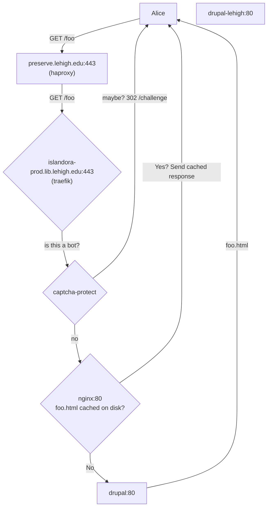
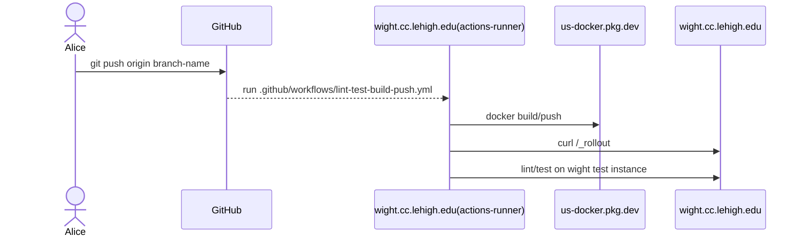
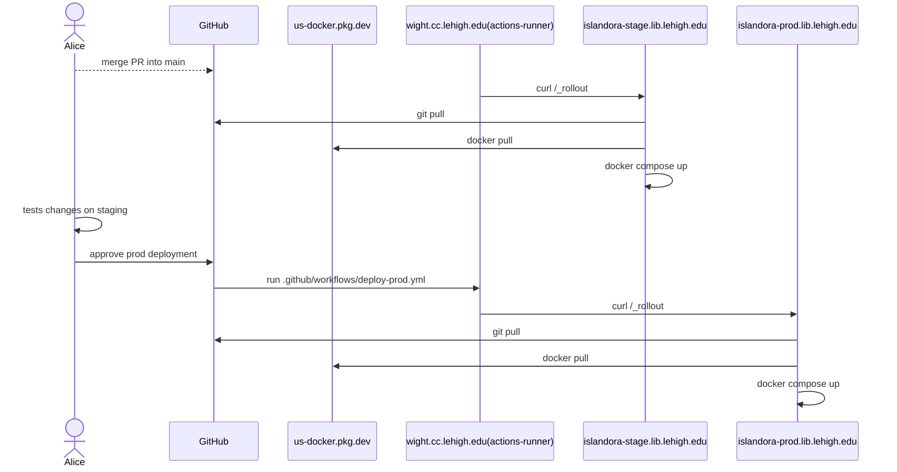

# Lehigh Preserve

- [Introduction](#introduction)
- [Requirements](#requirements)
- [Architecture](#architecture)
- [Production](#production)
  - [Setup as a systemd Service](#setup-as-a-systemd-service)
  - [Monitoring and Metrics](#monitoring-and-metrics)
- [CI/CD](#cicd)
  - [Microservices](#microservices)
- [Self Healing](#self-healing)
- [Backups](#backups)

## Introduction

This is the development and production infrastructure for Lehigh Preserve.

## Requirements

- [Docker 24.0+](https://docs.docker.com/get-docker/)
- [Docker Compose 2.0+](https://docs.docker.com/compose/install/linux/)
- [mkcert 1.4+](https://github.com/FiloSottile/mkcert)

## Architecture

### Network

Staging and production ISLE deployments are backends behind SET's managed haproxy instance.

Staging is a backend on SET's internal-only haproxy instance, which requires on-campus or VPN to access. Production is a backend on SET's external haproxy instance which allows `0.0.0.0/0` access.

haproxy manages TLS certificates for the site as well as a "tarpit" ruleset to block known bad actors // bots.



## Production

### Setup as a systemd Service

`systemd` is used to manage the docker compose stack. You can find the unit file in [scripts/systemd/islandora.service](./scripts/systemd/islandora.service)

The unit runs as the account `rollout` which will need privileges to run docker containers
```
usermod -aG docker rollout
```

The `rollout` account also needs from files used by the islandora docker compose stack

```
$ cat /home/rollout/.gitconfig
[safe]
	directory = /opt/islandora/d10_lehigh_agile

# auth'd to Google Artifact Registry for lehigh-lts-images
/home/rollout/.docker/config.json
# deploy token for the i2 repo in GitLab
/home/rollout/.ssh/id_rsa
```

### Monitoring and Metrics

### Monitoring

#### Uptime checks

Once `preserve.lehigh.edu` is pointing at i2, we'll have nagios uptime monitoring on the site. For now uptime is monitored with a simple bash script on the staging server that sends alerts to Slack `#libtech-islandora` when production is offline.

##### uriports

We're monitoring our [Content Security Policy](https://developer.mozilla.org/en-US/docs/Web/HTTP/CSP) using URIports.com. We're still in report only mode to avoid regressions as we craft the policy. We hope to have an enfored policy before June 24, 2024.

This URIports service is being used to help craft a content security policy we can enforce on the site to help prevent XSS vulnerabilities on our site. They provide dashboards to see what would have been blocked had our policy been in effect, which helps craft a policy.

We're also emitting network errors which can be [seen in their dashboard](https://app.uriports.com/report/network-error?search=contains%7Cislandora-prod.lib.lehigh.edu&expanded=Type%2CUrl&filter=Type%7Cabandoned) (requires an account). It's TBD how we might be able to alert on these errors from this service to help detect problems on the site. For now, it's just a weekly manual check on their dashboard to review errors.

#### Metrics

##### Google Analytics (GA) and Tag Manager (GTM)

The `LU Islandora Digital Collections - GA4` is collecting analytics from the production site. This integration is managed by the [Google Tag Drupal module](https://www.drupal.org/project/google_tag). We have a condition on the tag in Drupal so only our production domains are tracked and there's a role in Drupal called [GA - no tracking](https://islandora-prod.lib.lehigh.edu/admin/people?user=&status=All&role=ga_no_tracking&permission=All) if an authenticated user should not be tracked in GA you can add that role to a user account.

GA is feature rich analytics tool and allows a wide range of reporting for general web visitor analytics.

A great example on how we can leverage GTM would be creating a GTM to report how many search results were returned for a given query

##### Entity Metrics

A custom Drupal module was implemented to locally record and save a very limited scope of key metrics (namely page views and downloads) that links the metric to Islandora's data model. This was implemented because:

1. There's some unknowable questions with the free version of GTM how complete their reports may be. In some cases, Google has retention periods for data it collects that you can report on.
2. Past efforts of getting historical data out of GA in the event Google discontinues a service, or a web properties need to move between accounts, has proven difficult or in some cases simply not possible. Storing data locally ensures we will have historical metric data and that we could potentially migrate that to some future system
3. Managing sending event data to be able to report on in GA whether through custom JavaScript events or GTM is a process that's outside of a typical development workflow and can easily be forgotten or drift from the rendered HTML responses GTM relies on. Though we can help mitigate this risk by having functional javascript tests around what GTM expects. This shouldn't be strickly required for all GTM tracking but for imporant metrics it'd be wise to add in our CI/CD pipeline

##### System Metrics

SET manages a grafana and telegraf stack to collect system level metrics on the server that hosts ISLE.

[The dashboard for the production server is in grafana](https://grafana.cc.lehigh.edu/d/000000042/telegraf-metrics?orgId=1&refresh=30s&var-datasource=default&var-server=islandora-prod&var-inter=1m). There is a collapsed dashboard panel at the bottom of that page under `DOCKER` to see metrics per container.


## CI/CD

We use a self-hosted runner to deploy into our infrastructure. The runner is on the dev server, and is running via our [github-actions-runner docker image](https://github.com/lehigh-university-libraries/docker-builds/tree/main/actions-runner). The runner docker image should only need a valid runner registration token one time during initial setup, which has already been done. If it ever needs done again, you can edit `.env` on `wight.cc.lehigh.edu` and set the `--token XXX` value found at https://github.com/lehigh-university-libraries/isle-preserve/settings/actions/runners/new into the `GITHUB_RUNNER_TOKEN` variable.

The dev/stage/prod servers have a deploy key set at https://github.com/lehigh-university-libraries/isle-preserve/settings/keys to allow a `git pull`. It's the SSH public key at `/home/rollout/.ssh/id_rsa.pub`. That user also needs to have GitHub in its `/home/rollout/.ssh/known_hosts` file to allow `git pull`

Here is how the CI works. Basically, create a PR on a new branch. That will:

- run lint on the custom drupal modules
- build docker image for branch
- deploy branch to dev
- run tests



Once the PR is ready:

- merge into main
- main automatically deploys to stage
- manual approval to deploy to prod
  - manual approval is done by setting the GitHub Action job to use [the prod environment setup in GitHub](https://github.com/lehigh-university-libraries/isle-preserve/settings/environments/6279574835/edit)



### Microservices

All of the Islandora microservices are deployed in SET's kubernetes cluster.

A CI service account was created one time via

```
$ kubectl apply -f ci/svc.yaml
```

This is the kubernetes service account our CI pipeline authenticates as.

Then, whenever changes occur in `ci/k8s/*.yaml` that service account is used to `kubectl apply` [our microservice manifests](./ci/k8s)

The token used to authenticate is rotated every 10 hours on our self hosted runner via [scripts/ci/k8s/token.sh](./scripts/ci/k8s/token.sh). If needed, with your kubectl account you can generate a token with

```
kubectl create token isle-ci \
  --namespace=islandora-metadata \
  --duration=24h
ssh wight.cc.lehigh.edu
docker exec -it lehigh-d10-gha-runner-updater-1 bash
export TOKEN=TOKEN-YOU-GOT-FROM-ABOVE-COMMAND
/app/scripts/ci/k8s/token.sh
```

## Self Healing

There is [a systemd service](./scripts/systemd/health.service) that starts [docker-autoheal](https://github.com/lehigh-university-libraries/docker-autoheal) which runs on a 10s timer to check the health of the docker compose ISLE deployment. If a service is unhealthy or otherwise stopped, the script alerts via slack and basically just does `docker compose up -d`. Thrashing on the services is left to the tech admin to troubleshoot further.

## Backups

### Database

Every night the fcrepo and drupal databases are backed up. This is done with [a systemd timer](./scripts/systemd/backup.timer), [service](./scripts/systemd/backup.service) that runs [a bash script](./scripts/maintenance/backup.sh)

### Filesystem

The production filesystem is backed up every month to AWS Glacier using our [aws-backups](https://github.com/lehigh-university-libraries/aws-backups) script and systemd unit.

Our staging server has read only access to our production filesystem to keep files in sync

[LTS-15566](https://lehigh.atlassian.net/browse/LTS-15566)

> Okay, I’ve setup the overlay now on `islandora-test.lib.lehigh.edu`. `islandora-prod.cc.lehigh.edu` exports a read-only NFS share that’s mounted at `/mnt/islandora-prod-readonly` on `islandora-test`. Then I created a new LVM volume called `prod_overlay`, currently 30 gigs but we can grow it as needed - that’s used for the upperdir and workdir for the overlay, and it’s mounted at `/opt/prod_overlay`. Then I created the `/opt/islandora` mountpoint, which uses `/mnt/islandora-prod-readonly` as its lowerdir, and folders in the new LV for its upperdir and workdir.

#### Google Cloud Storage

There are also GCS buckets [defined via terraform](https://github.com/lehigh-university-libraries/gcloud-terraform/blob/main/projects/lehigh-preserve-isle/03-gcs.tf) that store files temporarily in a GCS bucket. These buckets are only used for a temporary holding place for user uploads from [https://preserve.lehigh.edu/submit](https://preserve.lehigh.edu/submit)

## TLS Certificates

The production and staging HTTP TLS certificates are managed by SET on their haproxy instance. This is for `preserve.lehigh.edu` and `islandora-stage.lib.lehigh.edu`

Production and staging also have self signed certificates used for JWT signing and to encrypt communications between haproxy and the given server. This is for `islandora-prod.lib.lehigh.edu` and `islandora-test.lib.lehigh.edu`

There is a third set of TLS certifactes in the kubernetes cluster managed by SET. This is stored in the `cc-tls` secret and is used for `isle-microservices.cc.lehigh.edu`. When this certificate rotates every year around November, it's possible the alpaca service doesn't have the trust chain in the container. To get it added, you can download the CA from the ingress controller like so

```
openssl s_client -connect isle-microservices.cc.lehigh.edu:443 -servername isle-microservices.cc.lehigh.edu <<EOF | openssl x509 -outform PEM > certs/lehigh.pem
GET /houdini HTTP/1.1
Host: isle-microservices.cc.lehigh.edu
EOF
```

## Legacy Redirects

When sites migrate from an old platform into The Preserve, redirects from the old URLs to their new location are maintained in [the nginx static conf](./conf/nginx.static])

We use nginx's map functionality for both code clarity and improved performance.

Adding a new site's redirect can be done by copying an existing `redirect-*.conf`, renaming the `map` variable to a unique name, adding the redirects in the map, and updating the `server` directive to use the map variable.
